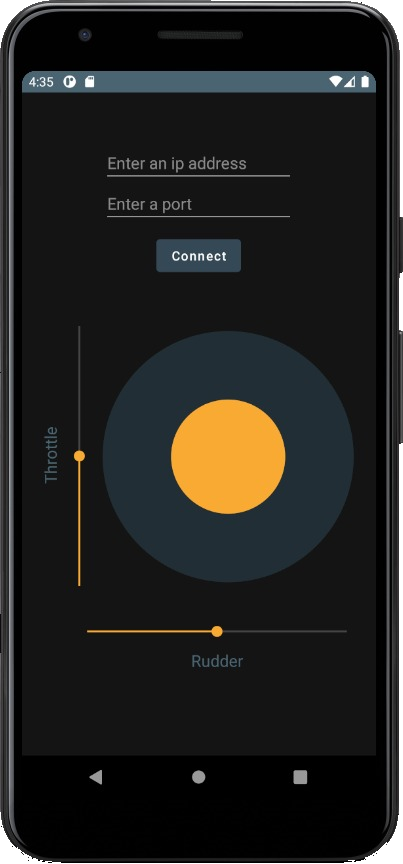
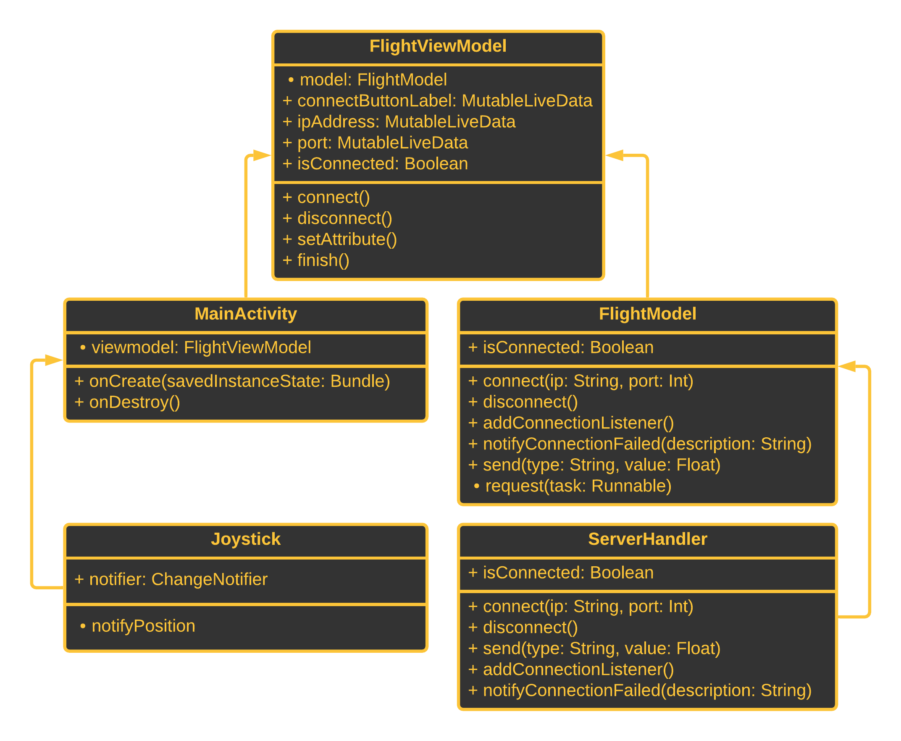

# FlightGear Android Controller v1.0



## Table of Contents
* [1. Introduction](#1-introduction)
* [2. Dependencies](#2-dependencies)
* [3. Installation and Usage](#3-installation-and-usage)
  * [3.1. Setup](#31-setup)
  * [3.2. User Guide](#32-user-guide)
* [4. UML Diagram](#4-uml-diagram)
* [5. Contributors](#5-contributors)
* [6. Links and Demonstration Video](#6-links-and-demonstration-video)

***

# 1. Introduction

This project is an android application that connects to FlightGear as a client and control the plane.

## This Version includes

* Minimalistic UI design that is simple and intuitive.
* Widgets that control FlightGear.
* Toasts that notify the user on certain events, such as:
  * A change in the connection status.
  * Connection failure.
  * Invalid user input.

***

# 2. Dependencies

The app is built and tested for [Android Kitkat 4.4](https://www.android.com/versions/kit-kat-4-4/).

***

# 3. Installation and Usage

## 3.1. Setup

It is recommended to build the app with [Android Studio](https://developer.android.com/studio).

* Load the project into Android Studio by clicking on `File` and then `Open Project`.
* Build the app.
* You can run the app on the emulator, or install it on your physical phone. 
* Configure `FlightGear`:
  * Run `FlightGear`.
  * Go to `settings`,
  * Scroll down to `additional settings` and type:
    ```
    --telnet=socket,in,10,127.0.0.1,6400,tcp
    ```
      Note: the configuration is for a server that runs on `127.0.0.1:6400`, you may want to change these settings to suit your needs.

## 3.2. User Guide

* You can now run the app.
* Type the address and port that you set on the server and click on `connect`.
* Inside `FlightGear` set the `autostart` option in the settings.
* You can now freely control the plane using the seekbars and the joystick.

***

# 4. UML Diagram



The diagram shows the main classes. The missing classes are mainly small helper classes that are less relevant to the overall design of the project.

## 4.1. Design Info

* The project uses MVVM to separate the view from the model.
* `FlightModel` uses Active-Object to run tasks in a background thread.
* `ServerHandler` handles all the networking-related code. Also, holds a list of listeners which are notified every network update.
* The View is updated using two-way databinding on `FlightViewModel`'s fields.

***

# 5. Contributors

* [Belo Coral](https://github.com/coralbelo)
* [Dado Yarin](https://github.com/yarin-da)

***

# 6. Links and Demonstration Video

* [Android Kitkat 4.4](https://www.android.com/versions/kit-kat-4-4/)
* [Android Studio](https://developer.android.com/studio)
* [Demonstration Video](https://youtu.be/Jieybv6ftOI)